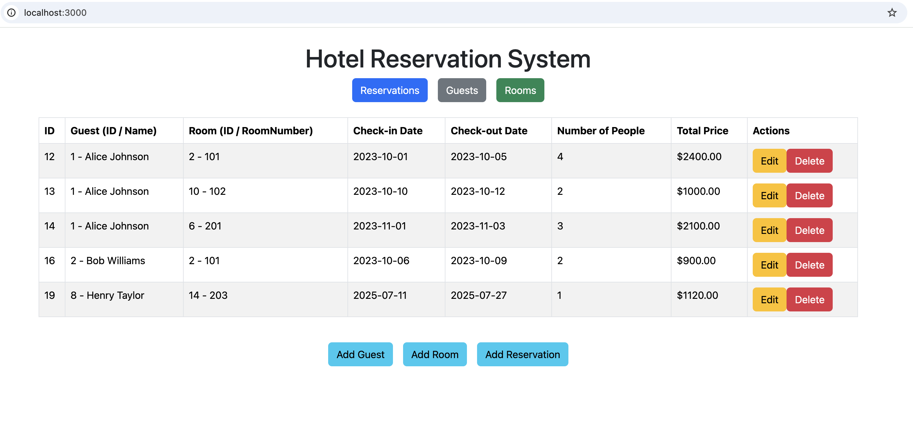
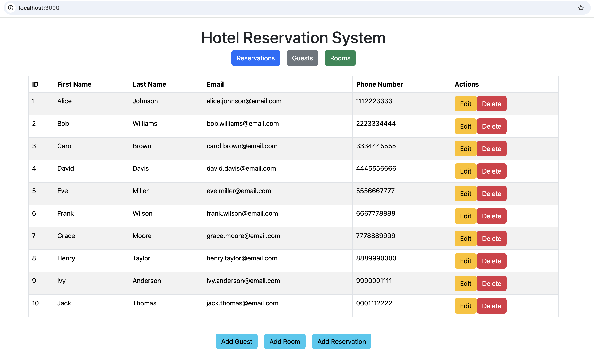
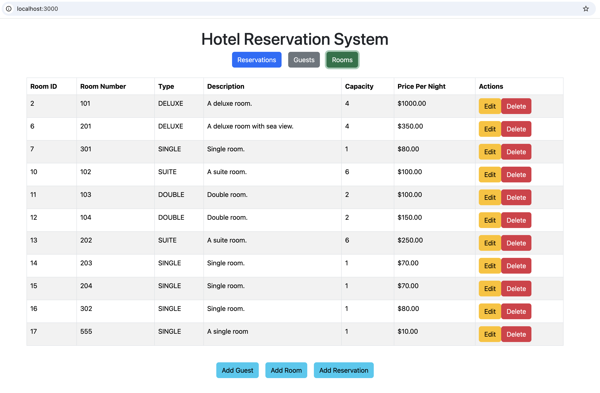
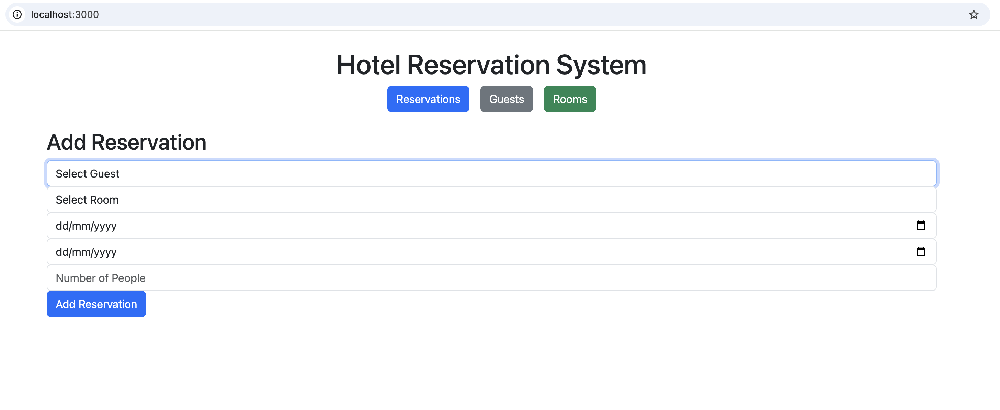

# Getting Started

### Reference Documentation

For further reference, please consider the following sections:

* [Official Apache Maven documentation](https://maven.apache.org/guides/index.html)
* [Spring Boot Maven Plugin Reference Guide](https://docs.spring.io/spring-boot/3.5.3/maven-plugin)
* [Create an OCI image](https://docs.spring.io/spring-boot/3.5.3/maven-plugin/build-image.html)
* [Spring Data JPA](https://docs.spring.io/spring-boot/3.5.3/reference/data/sql.html#data.sql.jpa-and-spring-data)
* [Spring Boot DevTools](https://docs.spring.io/spring-boot/3.5.3/reference/using/devtools.html)
* [Spring Web](https://docs.spring.io/spring-boot/3.5.3/reference/web/servlet.html)

### Guides

The following guides illustrate how to use some features concretely:

* [Accessing Data with JPA](https://spring.io/guides/gs/accessing-data-jpa/)
* [Building a RESTful Web Service](https://spring.io/guides/gs/rest-service/)
* [Serving Web Content with Spring MVC](https://spring.io/guides/gs/serving-web-content/)
* [Building REST services with Spring](https://spring.io/guides/tutorials/rest/)

### Maven Parent overrides

Due to Maven's design, elements are inherited from the parent POM to the project POM.
While most of the inheritance is fine, it also inherits unwanted elements like `<license>` and `<developers>` from the
parent.
To prevent this, the project POM contains empty overrides for these elements.
If you manually switch to a different parent and actually want the inheritance, you need to remove those overrides.

### Run Application Locally

#### Create a local database 

Run postgres in a docker container:

```bash
docker run --name postgres-otel-reservation -e POSTGRES_DB=otel_reservation -e POSTGRES_USER=postgres -e POSTGRES_PASSWORD=postgres -p 5432:5432 -d postgres:16
```

#### Run the backend application 

You can run the application using the following command:

```bash
mvn spring-boot:run
``` 

To interact with room;

add a room;

```bash
curl -X POST http://localhost:9090/otel-reservation/1/room -H 'Content-Type: application/json' -d '{"roomNumber": 101, "roomType": "DELUXE", "description": "A deluxe room with sea view.", "capacity": 4, "pricePerNight": 150.00}'
```

get room by id;

```bash
curl -X GET http://localhost:9090/otel-reservation/1/rooms
curl -X GET http://localhost:9090/otel-reservation/1/room/2 
```

To create some test data, you can use the following command:

```bash
curl -X POST http://localhost:9090/otel-reservation/1/room -H 'Content-Type: application/json' -d '{"roomNumber": "101", "roomType": "DELUXE", "description": "A deluxe room.", "capacity": 4, "pricePerNight": 150.00}'
curl -X POST http://localhost:9090/otel-reservation/1/room -H 'Content-Type: application/json' -d '{"roomNumber": "201", "roomType": "DELUXE", "description": "A deluxe room with sea view.", "capacity": 4, "pricePerNight": 350.00}'
curl -X POST http://localhost:9090/otel-reservation/1/room -H 'Content-Type: application/json' -d '{"roomNumber": "301", "roomType": "DELUXE", "description": "A deluxe room with more sea view.", "capacity": 4, "pricePerNight": 750.00}'
curl -X POST http://localhost:9090/otel-reservation/1/room -H 'Content-Type: application/json' -d '{"roomNumber": "102", "roomType": "SUITE", "description": "A suite room.", "capacity": 6, "pricePerNight": 250.00}'
curl -X POST http://localhost:9090/otel-reservation/1/room -H 'Content-Type: application/json' -d '{"roomNumber": "202", "roomType": "SUITE", "description": "A suite room.", "capacity": 6, "pricePerNight": 250.00}'
curl -X POST http://localhost:9090/otel-reservation/1/room -H 'Content-Type: application/json' -d '{"roomNumber": "103", "roomType": "DOUBLE", "description": "Double room.", "capacity": 2, "pricePerNight": 100.00}'
curl -X POST http://localhost:9090/otel-reservation/1/room -H 'Content-Type: application/json' -d '{"roomNumber": "104", "roomType": "DOUBLE", "description": "Double room.", "capacity": 2, "pricePerNight": 100.00}'
curl -X POST http://localhost:9090/otel-reservation/1/room -H 'Content-Type: application/json' -d '{"roomNumber": "301", "roomType": "SINGLE", "description": "Single room.", "capacity": 1, "pricePerNight": 80.00}'
curl -X POST http://localhost:9090/otel-reservation/1/room -H 'Content-Type: application/json' -d '{"roomNumber": "302", "roomType": "SINGLE", "description": "Single room.", "capacity": 1, "pricePerNight": 80.00}'
curl -X POST http://localhost:9090/otel-reservation/1/room -H 'Content-Type: application/json' -d '{"roomNumber": "203", "roomType": "SINGLE", "description": "Single room.", "capacity": 1, "pricePerNight": 70.00}'
curl -X POST http://localhost:9090/otel-reservation/1/room -H 'Content-Type: application/json' -d '{"roomNumber": "204", "roomType": "SINGLE", "description": "Single room.", "capacity": 1, "pricePerNight": 70.00}'
```

To interact with guest;

to add a guest;

```bash
curl -X POST http://localhost:9090/otel-reservation/1/guest -H 'Content-Type: application/json' -d '{"firstName": "John", "lastName": "Smith", "email": john.smith@email.com", "phone": "1234567890"}'
```

to get guest;

```bash
curl -X GET http://localhost:9090/otel-reservation/1/guests
curl -X GET http://localhost:9090/otel-reservation/1/guest/2
```

To create some test data, you can use the following command:

```bash
curl -X POST http://localhost:9090/otel-reservation/1/guest -H 'Content-Type: application/json' -d '{"firstName": "Alice", "lastName": "Johnson", "email": "alice.johnson@email.com", "phoneNumber": "1112223333"}'
curl -X POST http://localhost:9090/otel-reservation/1/guest -H 'Content-Type: application/json' -d '{"firstName": "Bob", "lastName": "Williams", "email": "bob.williams@email.com", "phoneNumber": "2223334444"}'
curl -X POST http://localhost:9090/otel-reservation/1/guest -H 'Content-Type: application/json' -d '{"firstName": "Carol", "lastName": "Brown", "email": "carol.brown@email.com", "phoneNumber": "3334445555"}'
curl -X POST http://localhost:9090/otel-reservation/1/guest -H 'Content-Type: application/json' -d '{"firstName": "David", "lastName": "Davis", "email": "david.davis@email.com", "phoneNumber": "4445556666"}'
curl -X POST http://localhost:9090/otel-reservation/1/guest -H 'Content-Type: application/json' -d '{"firstName": "Eve", "lastName": "Miller", "email": "eve.miller@email.com", "phoneNumber": "5556667777"}'
curl -X POST http://localhost:9090/otel-reservation/1/guest -H 'Content-Type: application/json' -d '{"firstName": "Frank", "lastName": "Wilson", "email": "frank.wilson@email.com", "phoneNumber": "6667778888"}'
curl -X POST http://localhost:9090/otel-reservation/1/guest -H 'Content-Type: application/json' -d '{"firstName": "Grace", "lastName": "Moore", "email": "grace.moore@email.com", "phoneNumber": "7778889999"}'
curl -X POST http://localhost:9090/otel-reservation/1/guest -H 'Content-Type: application/json' -d '{"firstName": "Henry", "lastName": "Taylor", "email": "henry.taylor@email.com", "phoneNumber": "8889990000"}'
curl -X POST http://localhost:9090/otel-reservation/1/guest -H 'Content-Type: application/json' -d '{"firstName": "Ivy", "lastName": "Anderson", "email": "ivy.anderson@email.com", "phoneNumber": "9990001111"}'
curl -X POST http://localhost:9090/otel-reservation/1/guest -H 'Content-Type: application/json' -d '{"firstName": "Jack", "lastName": "Thomas", "email": "jack.thomas@email.com", "phoneNumber": "0001112222"}'
```

To interact with reservation;

to add a reservation;

```bash
curl -X POST http://localhost:9090/otel-reservation/1/reservation -H 'Content-Type: application/json' -d '{"guestId": 1, "roomId": 2, "checkInDate": "2023-10-01", "checkOutDate": "2023-10-05", "numberOfPeople": 4}'
```

to get reservation;

```bash
curl -X GET http://localhost:9090/otel-reservation/1/reservations
curl -X GET http://localhost:9090/otel-reservation/1/reservation/1
```

To create some test data, you can use the following command:

```bash
curl -X POST http://localhost:9090/otel-reservation/1/reservation -H 'Content-Type: application/json' -d '{"guestId": 1, "roomId": 2, "checkInDate": "2023-10-01", "checkOutDate": "2023-10-05", "numberOfPeople": 4}'
curl -X POST http://localhost:9090/otel-reservation/1/reservation -H 'Content-Type: application/json' -d '{"guestId": 1, "roomId": 10, "checkInDate": "2023-10-10", "checkOutDate": "2023-10-12", "numberOfPeople": 2}'
curl -X POST http://localhost:9090/otel-reservation/1/reservation -H 'Content-Type: application/json' -d '{"guestId": 1, "roomId": 6, "checkInDate": "2023-11-01", "checkOutDate": "2023-11-03", "numberOfPeople": 3}'
curl -X POST http://localhost:9090/otel-reservation/1/reservation -H 'Content-Type: application/json' -d '{"guestId": 3, "roomId": 13, "checkInDate": "2023-12-15", "checkOutDate": "2023-12-18", "numberOfPeople": 4}'
curl -X POST http://localhost:9090/otel-reservation/1/reservation -H 'Content-Type: application/json' -d '{"guestId": 2, "roomId": 2, "checkInDate": "2023-10-06", "checkOutDate": "2023-10-09", "numberOfPeople": 2}'
```

#### Run the frontend application

You can see the required steps to run the frontend application in the [frontend](frontend/README.md) directory.

#### Example Screenshots from the Application




